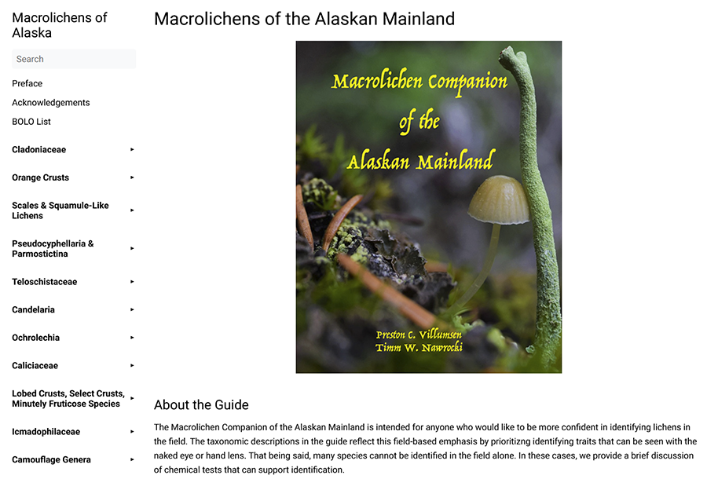
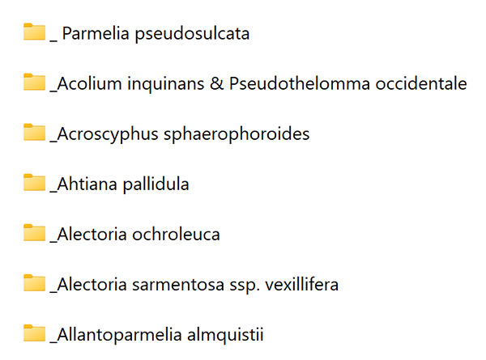

# Macrolichens of the Alaskan Mainland



## About the Project 🪸

This project provides a set of Python scripts to convert the raw text and image files from the *Macrolichen 
Companion of the Alaskan Mainland* into a structured format suitable for a [Hugo](https://gohugo.io/) static site generator.

The primary 
goal is to transform the original field guide content into an accessible and easily maintainable online resource,
 tapping into Hugo's capabilities for generating fast, modern, and navigable websites. This 
digital format enhances the guide's usability by allowing for dynamic search, easier updates, and broader 
accessibility for scientists and enthusiasts alike.

The scripts automate the website building process by batch processing species descriptions (Word documents) 
and associated photographs (image files) to generate corresponding Markdown and HTML files. These output files 
integrate seamlessly with a Hugo project, enabling swift deployment of and updates to a digital version of the Alaska Macrolichens Guide. 

### Built With 🛠️

* **Python 3.13+** 
* **Miniforge** (with conda and conda-forge channel) - For package management.
* **[Polars](https://pola.rs/)** - For data manipulation. 
* **[python-docx](https://python-docx.readthedocs.io/)** - For working with .docx (Microsoft Word) files. 
* **[Pathlib](https://docs.python.org/3/library/pathlib.html)** - For object-oriented filesystem paths.
* **[textwrap](https://docs.python.org/3/library/textwrap.html)** - For dedenting strings. 
* **[re](https://docs.python.org/3/library/re.html)** - For string pattern matching using regular expressions. 
* **[shutil](https://docs.python.org/3/library/shutil.html)** - For high-level file operations e.g., copying files.

## Getting Started 🚀
Follow these simple steps to run these scripts on your local machine.

### Prerequisites
Before you begin, ensure you have the following installed:

* **Git**: For cloning the repository.
* **Miniforge**: Optional, but recommended. Miniforge is an open-source, minimalist package manager that 
  provides `conda` and defaults to the `conda-forge` channel.
    * You can download the appropriate installer for your system from the [Miniforge GitHub releases page](https://github.com/conda-forge/miniforge/releases).
    * Jan Kirenz has a short and sweet [Miniforge setup tutorial](https://kirenz.github.io/codelabs/codelabs/miniforge-setup/) to help you get started.
* **Hugo website**. The scripts are formatted to be used with the Hugo documentation theme [as simple as plain 
  book](https://github.com/alex-shpak/hugo-book).

### Installation

1.  **Clone the repository**:
    Open your terminal or command prompt and clone the project repository to your local machine using Git:
    ```bash
    git clone [https://github.com/accs-uaa/akveg-lichens.git](https://github.com/accs-uaa/akveg-lichens.git)
    ```

2.  **Navigate to the project directory**:
    Change into the cloned project directory:
    ```bash
    cd akveg-lichens
    ```
    
3. **Create and activate a Conda environment**:
    Creating a dedicated Conda environment for this project will help you to manage dependencies and avoid conflicts 
    with other Python installations.

    ```bash
    conda create -n akveg-lichens python=3.13
    conda activate akveg-lichens
    ```
    
4.  **Install dependencies**:
    Once your Conda environment is active, install the required Python libraries. All libraries can be installed 
    from the `conda-forge` channel.
    ```bash
    conda env create -f environment.yml
    ```
    This command will install all libraries listed in the `environment.yml` file, which are necessary for the 
    scripts to run 
    correctly.

## Usage ▶️

This project provides a suite of Python scripts to process your raw .docx files and associated images, transforming 
them into a structured format suitable for generating a Hugo website. 

You will almost certainly have to modify these scripts to match the document formatting and folder structure of your project. 
Nevertheless, these scripts can provide a jumping off point that you can apply to your use case.

1. **Prepare your input files**

Ensure your raw .docx files and image files are located in same parent directory. The script assumes that there is 
one sub-folder per taxon that contains both the images and .docx files for that taxon.



The .docx files in this project did not use any headings. Sections were identified at the start of each paragraph 
using the section name followed by a colon and a white space (e.g., Description: ). All files followed this same 
template.

2. **Run the processing scripts**

Scripts are numbered sequentially according to the order in which they should be executed.

The first script, `01_create_toc.py`, establishes the Table of Contents for the Hugo website by creating folders 
for each taxonomic group. Each folder is then populated with an index Markdown file that specifies the title and 
order of that group within the table of contents.

The second script, `02_format_descriptions.py` is the main processing script that will convert your .docx content into 
Markdown files and copy your images.

This script will:
- Extract images found in the sub-folders of the parent directory. 
- Copy these images to static/images/ within your Hugo site structure.
- Read .docx files from the specified input directory. 
- Convert them into Markdown files. 
- Add the corresponding images to each file.
- Save the files to the appropriate taxonomic group sub-folder (created in the TOC script).

3. **View your site locally**

Once the content and images are processed, navigate to your Hugo site's root directory and use Hugo's built-in 
command to preview your generated Hugo site by starting local server:

```bash
cd path/to/your/hugo/site
hugo server
```

4. **Build your Hugo site**

When you are happy with the way things look, compile all your Markdown content and static assets into 
the public/ directory, ready for deployment.

```bash
hugo
```

## Project Information

### License ⚖️
This project is provided under the [GNU General Public License v3.0](https://www.gnu.org/licenses/gpl-3.0.html). It 
is free to use and modify in part or in 
whole.

### Contact 📧
* **Project Maintainer**: Amanda Droghini 
* **Email**: adroghini (at) alaska.edu
* **GitHub**: [@adroghini](https://github.com/adroghini)
